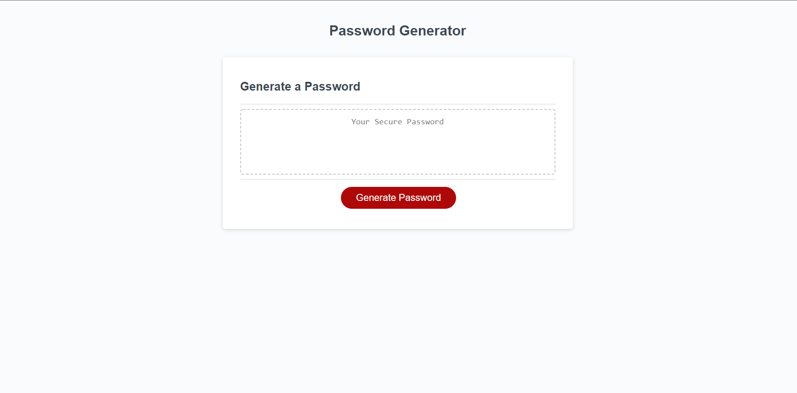

# Password Generator

## Description

This website features a random password generator. It allows users to select a length between 8 and 128 characters. It then asks them whether they want the password to use lowercase, uppercase, numeric, and special characters, of which they must choose at least one. It then gives them a password that meets that criteria.

The deployed site can be found at: https://spencerhulse.github.io/password-generator/

## Table of Contents

- [Installation](#installation)
- [Usage](#usage)
- [License](#license)
- [Contributing](#contributing)
- [Tests](#tests)
- [Questions](#questions)
  

## Installation

Just go to the deployed site to use. Or clone it and open the HTML file in the browser.

## Usage

Open it, click generate password, and follow the instructions.

## License

This project is covered under the following license:

[MIT](https://www.mit.edu/~amini/LICENSE.md)

## Contributing

No contributions at this time.

## Tests

Simply follow the instructions to see how it works.

## Questions

If you wish to view more of my work, feel free to visit my GitHub account. Additionally, if you have any questions, you can contact me at the email address below. Thanks!

[GitHub](https://github.com/SpencerHulse)

<hulse.spencer@gmail.com>
